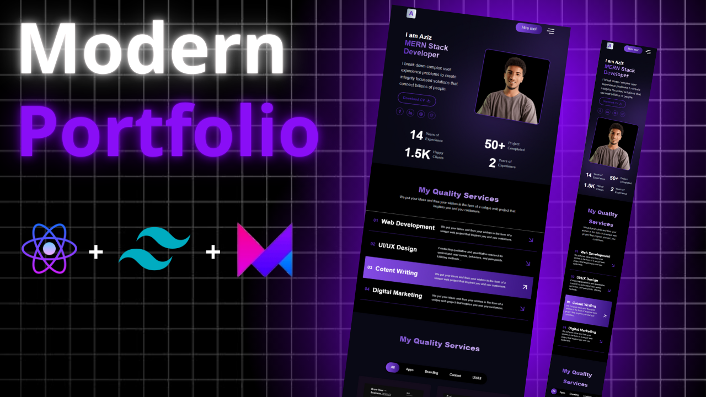

# Modern Portfolio 🚀

A modern and responsive portfolio website built with **React,** **Tailwind CSS,**  and **Framer Motion**.  
This project is designed to showcase your personal brand, skills, and projects in a clean and professional way.

---

## ✨ Features

- 🎨 Modern and minimalist UI
- 📱 Fully responsive (mobile-first design)
- ⚡ Built with React + Tailwind CSS + Framer Motion
- 🖼️ Projects showcase section
- 📧 Contact form integration
- 🌙 Clean and simple code structure

---

## 🛠️ Tech Stack

- **React** – Frontend library
- **Tailwind CSS** – Styling framework
- **Framer Motion** – Animation Framework
- **JavaScript (ES6+)** – Logic & interactivity
- **Vite / CRA** – Fast build setup (depending on project setup)

---

## 🚀 Getting Started

### 1️⃣ Clone the repository
```bash
git clone https://github.com/aziz-chniti/modern-portfolio.git
cd modern-portfolio
```

### 2️⃣ Install dependencies
```bash
npm install
```

### 3️⃣ Run the development server
```bash
npm run dev
```

### 4️⃣ Build for production
```bash
npm run build
```

---

## 📸 Demo



---

## 📬 Contact

If you like this project or want to collaborate, feel free to reach out:  

- Upwork: [Available](https://www.upwork.com/freelancers/~014afdcf19c4e3bb74)
- Youtube: [@Barmajli](https://www.youtube.com/@Barmajli)
- Demo link: *(Add your live link here)*  

---

⭐ Don’t forget to star this repo if you find it useful!
